# AI Powered Analytics with Oracle Fusion AI Data Platform

## Introduction

Oracle Fusion Data Intelligence (FDI) is a suite of prebuilt, cloud-native analytics applications designed for Oracle Cloud Applications. It delivers ready-to-use insights that help line-of-business users make better decisions and drive business performance.

Built on Oracle Analytics Cloud and Oracle Autonomous Data Warehouse, the FDI provides best-practice Key Performance Indicators (KPIs) and in-depth analyses that empower both decision-makers and individual contributors.

The service begins with Oracle Fusion Cloud Applications, which can be rapidly deployed, personalized, and extended. It automatically extracts data from these applications and loads it into an Oracle Autonomous Data Warehouse instance. Business users can then create and tailor dashboards in Oracle Analytics Cloud, leveraging AI-powered, self-service analytics for data preparation, visualization, reporting, augmented analysis, and natural language queries.

This lab enables business users to explore data, investigate trends, and uncover patterns or outliers, helping them turn insights into action.

### Objectives

Leveraging Gen-AI to build bank construction dashboard and forecasting to generate insights

## Lab 1

1. Step 1 - Login to your Fusion Data Intelligence environment using the URL provided. Open a web browser and enter the URL provided, then on the login screen, type in the Username and Password. Click “Sign In”.

	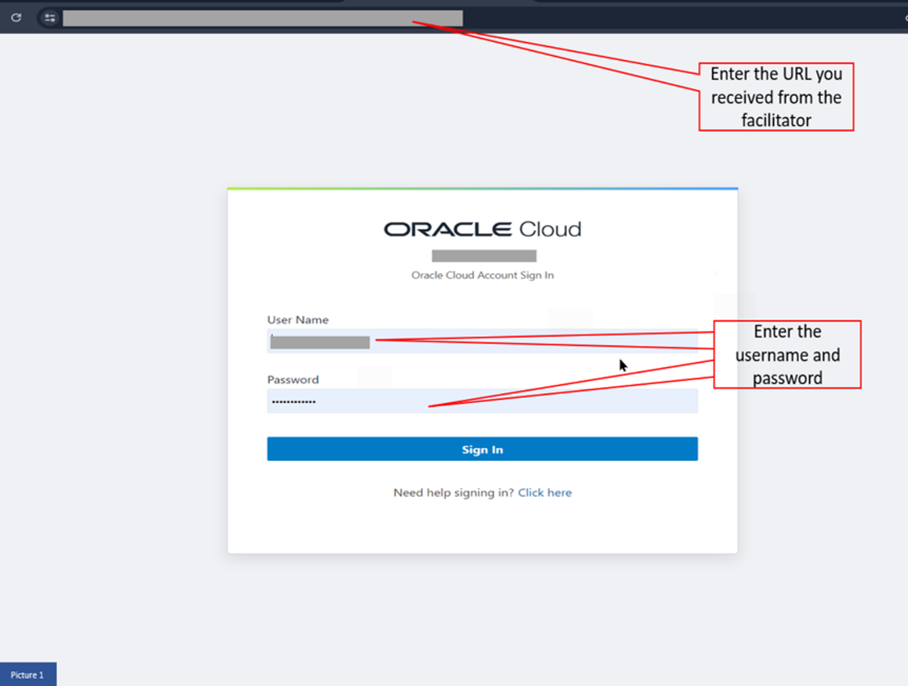

2. Step 2 - On the KPI Watchlist, hover on Cost Variance by Month, Bank tile and click on Open Workbook Icon

  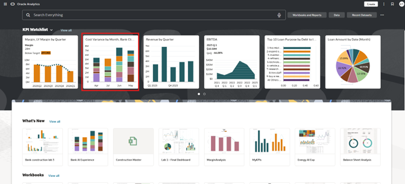

3. Step 3 - Click on Edit 

  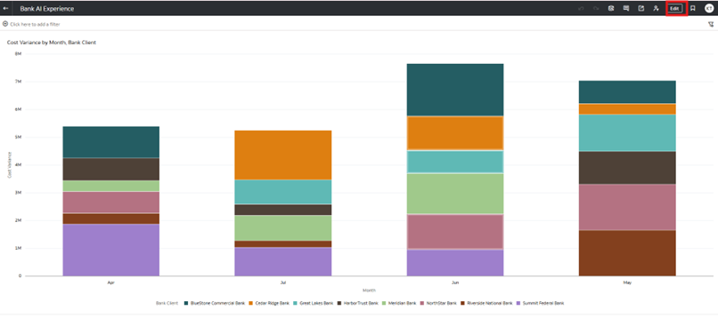

4. Step 4 - Click on top gray bar on the right that says Auto Insights Icon (Looks like three starts). 

  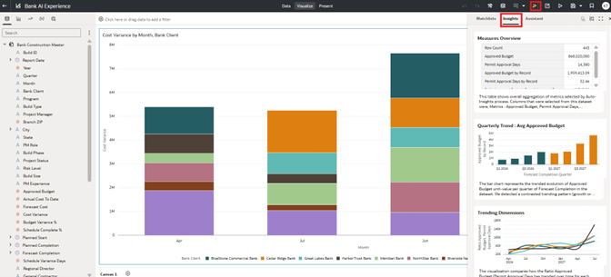

5. Step 5 - To add Chat hover over visualization and select + sign icon. This will add chart to canvas.

  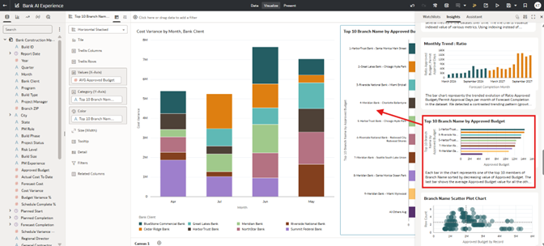

6. Step 6 - Click Canvas 2.

  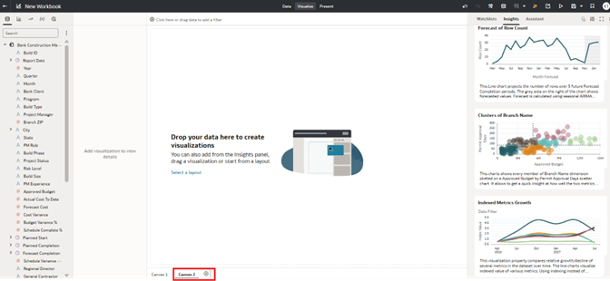

7. Step 7 - Right click on Risk Level and elect Explain Risk Level. Hover over visualization and click the “+” sign to add to canvas.

  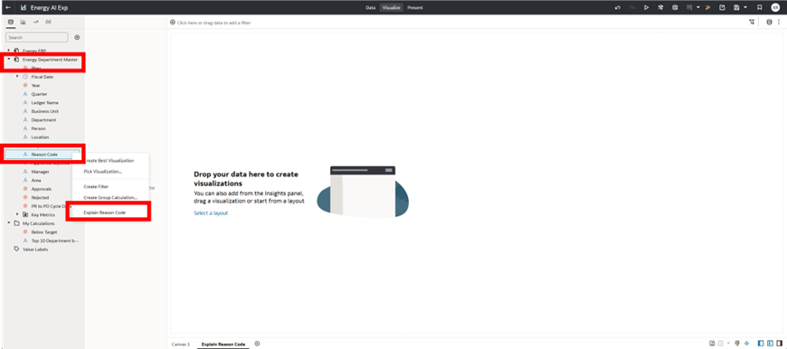

8. Step 8 - Click on green arrow. Then click on Add Selected Button to add to Canvas.

  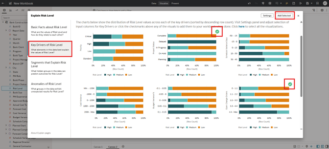

9. Step 9 - From the drop-down menu in the grammar pane, select the stacked bar chart icon.

  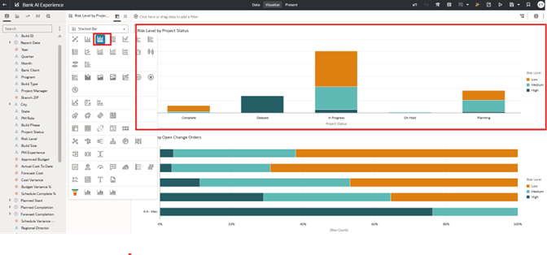

10. Step 10 - Drag and drop Risk Level by Open Change Orders object next the first object.

  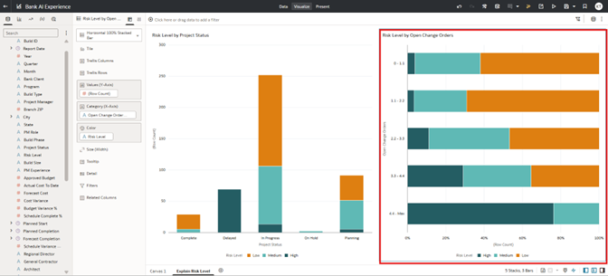

11. Step 11 - Place cursor over Risk Level by Open Change Orders and change object type to Language Narrative.  Now you should see breakdown of the summary in natural language.

  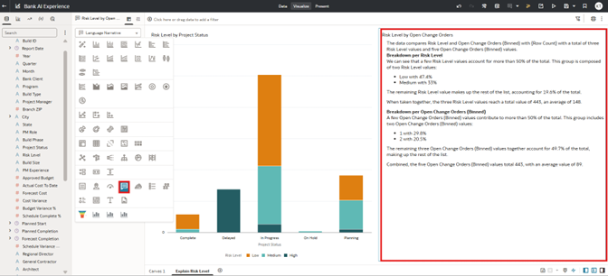

12. Step 12 - Click on top gray bar on the right that says Auto Insights Icon (Looks like three starts). Click in Assistant Tab.

  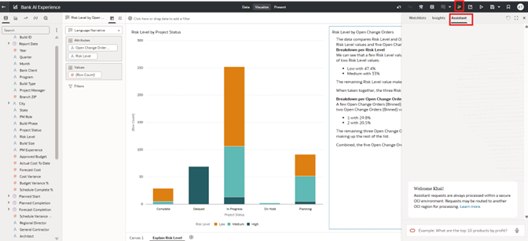

13. Step 13 - Type in “Show actual cost to date by report date week and bank client” and hit Enter

  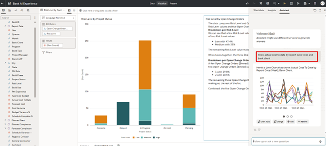

14. Step 14 - Type in “Change to stacked bar chart” and hit Enter. Hover over the visualization and click the “+” sign to add to the canvas.

  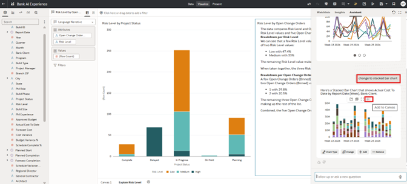

15. Step 15 - Type in “Show approved budget by build type” and hit Enter.

  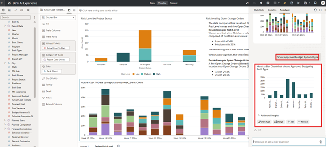

16. Step 16 - Type in “change to Tree Map chart” and hit Enter. Hover over the visualization and click the “+” sign to add to canvas.

  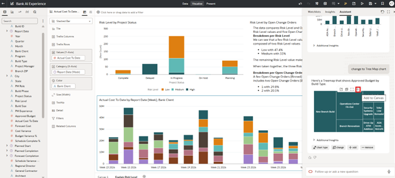

17. Step 17 - Type in “show next milestone by bank client” and hit Enter. Change the order of the table column.  Type in “swap order of columns” and hit Enter. Hover over the visualization and click the “+” sign to add to canvas.

  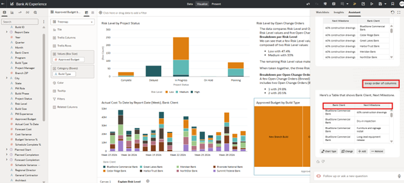

18. Step 18 - Type in “show crew size by PM role” and hit Enter. Hover over the visualization and click the “+” sign to add to canvas.

  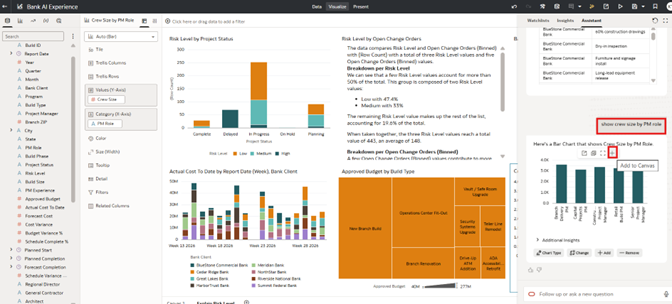

19. Step 19 - Type in “show open approvals and open RFIs by report date month” and hit Enter. Hover over the visualization and click the “+” sign to add to canvas. Close out Assistant by clicking on X in upper right corner of the assistant pane.

  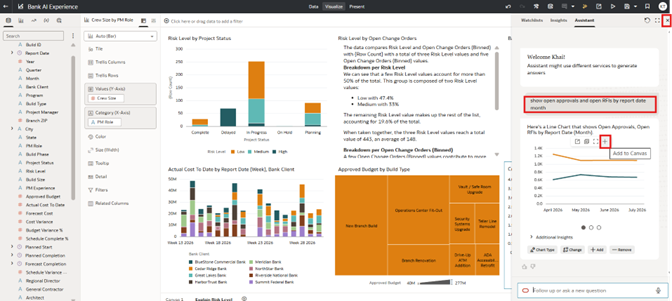

20. Step 20 - Now let’s explore how we can edit visualizations directly on the canvas

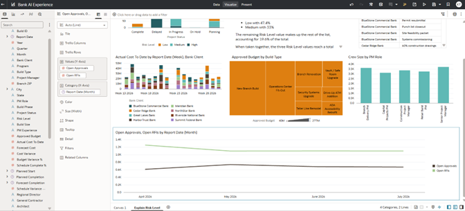

21. Step 21 - Type in “show open approvals and open RFIs by report date month” and hit Enter. Hover over the visualization and click the “+” sign to add to canvas. Close out Assistant by clicking on X in upper right corner of the assistant pane.

  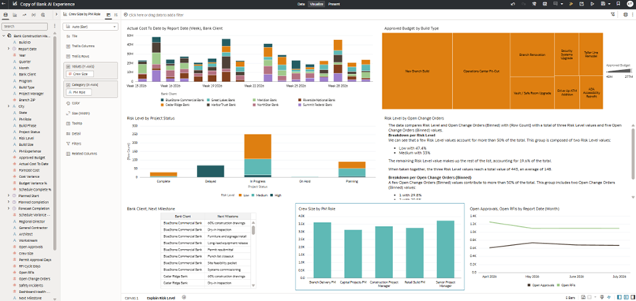

22. Step 22 - Place cursor on the chart object for Approved Budget by Build Type.   In the Grammar Panel, drag “Build Type” from Category (Boxes) to Color.

23. Step 23 - Click on Properties icon and change Legend Position from Auto to None.

  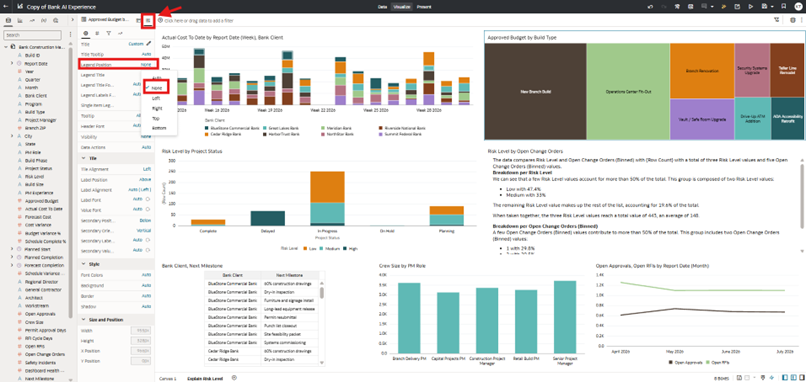

24. Step 24 - Put cursor over the Open Approvals, Open RFIs ..chart.  Click on the 3 dot icon, and select Add Statistics, and then Forecast.

  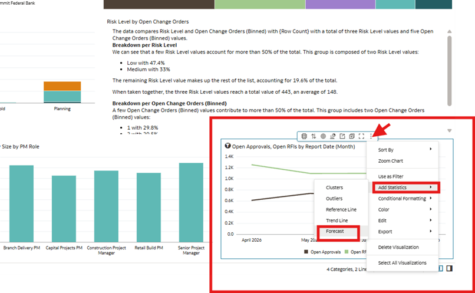

25. Step 25 - The completed visualization should look like this screen shot.

  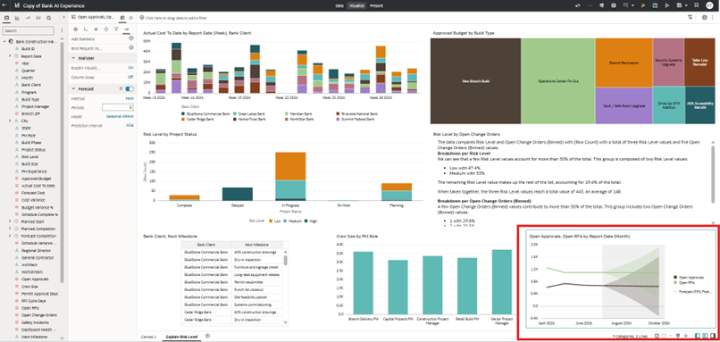

26. Step 26 - In the Data source panel, drag “Project Manager” field into the Filter area.

  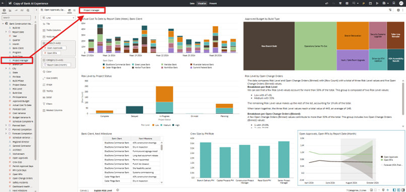

27. Step 27 - In the lower right-hand corner, unclick on the two icons for Data and Grammar panels.  You should now see the enter dashboard.

  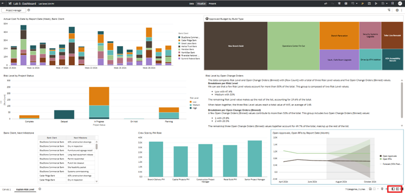 

28. Step 28 - Let’s start interacting with this dashboard by narrow down our filter by a project manager, and see any correction for Approved Budget by Build Type, Risk Level, Milestone, etc

  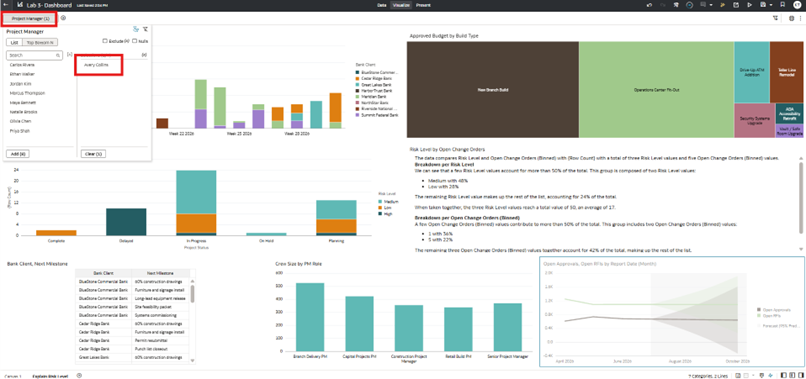

29. Step 29 - Click on the Risk Level by Project Status object, and right-click on the Delay bar, and select “Keep Selected”.  The dashboard should now look as follows.

  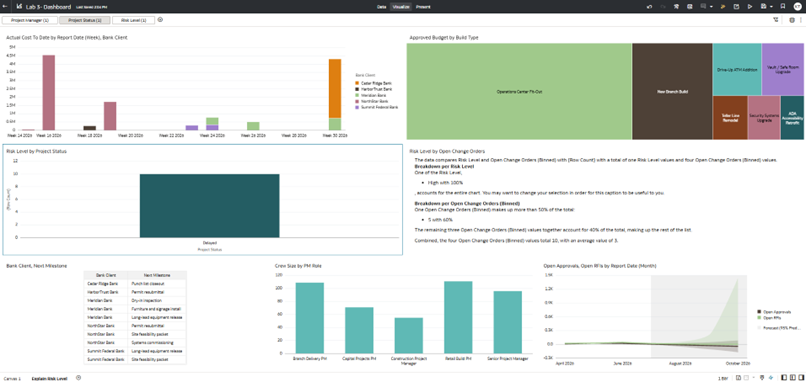 

30. Step 30 - Right click on the “Cedar Ridge Bank” and select “Keep Selected”

  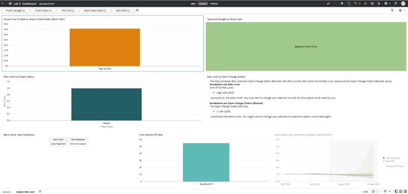

## Acknowledgements
* **Author** - <Xavier Ramirez, Anthony Lee>
* **Last Updated By/Date** - <Xavier Ramirez, Dec 2025>