# AI Powered Analytics with Oracle Fusion Data Intelligence

## Introduction

Oracle Fusion Data Intelligence (FDI) is a suite of prebuilt, cloud-native analytics applications designed for Oracle Cloud Applications. It delivers ready-to-use insights that help line-of-business users make better decisions and drive business performance.

Built on Oracle Analytics Cloud and Oracle Autonomous Data Warehouse, the FDI provides best-practice Key Performance Indicators (KPIs) and in-depth analyses that empower both decision-makers and individual contributors.

The service begins with Oracle Fusion Cloud Applications, which can be rapidly deployed, personalized, and extended. It automatically extracts data from these applications and loads it into an Oracle Autonomous Data Warehouse instance. Business users can then create and tailor dashboards in Oracle Analytics Cloud, leveraging AI-powered, self-service analytics for data preparation, visualization, reporting, augmented analysis, and natural language queries.

This lab enables business users to explore data, investigate trends, and uncover patterns or outliers, helping them turn insights into action.

### Objectives

Leveraging Gen-AI to construction portfolio bank dashboard to generate insights

## Lab 2

1. Click on new Canvas

  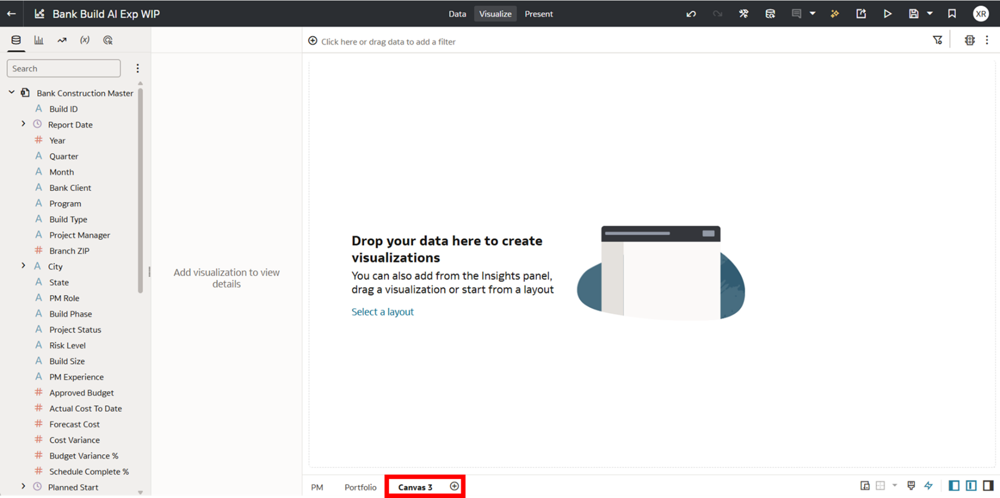

2. Go to AutoInsights tab, then Assistant tab, type the following prompt. Show approved budget and actual cost to date by city. Hit Enter button

  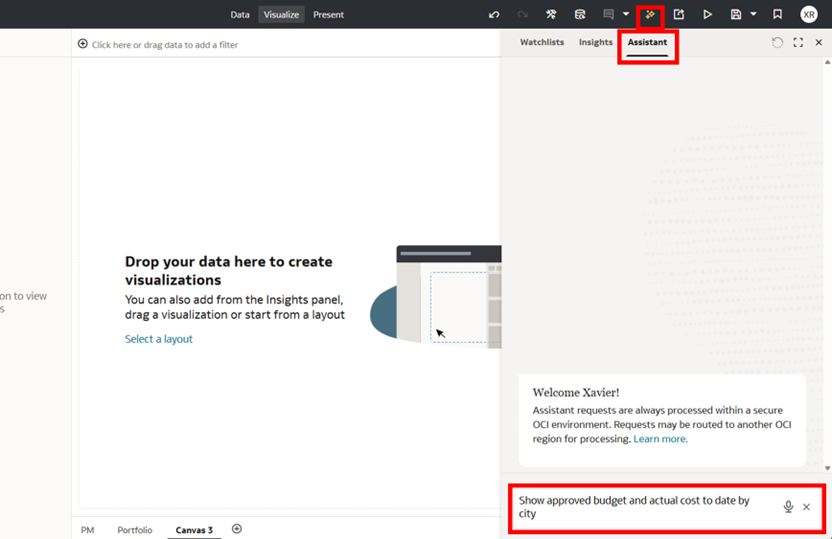

3. Hover over visualization in Assistant and click on plus sign to add to canvas

  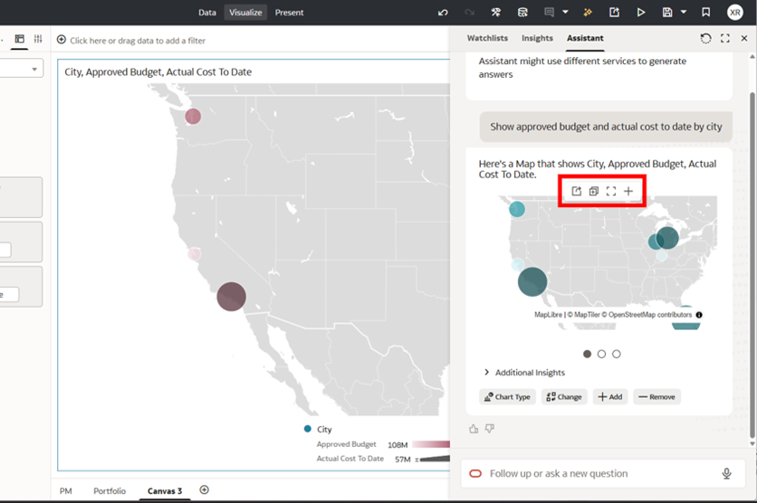

4. In Assistant add the following prompt: Show schedule complete % by bank client and risk level

  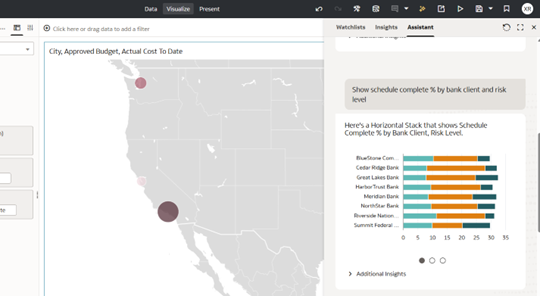

5. In Assistant add the following prompt: Change to pivot table with Risk in columns, bank client in rows, % in values

  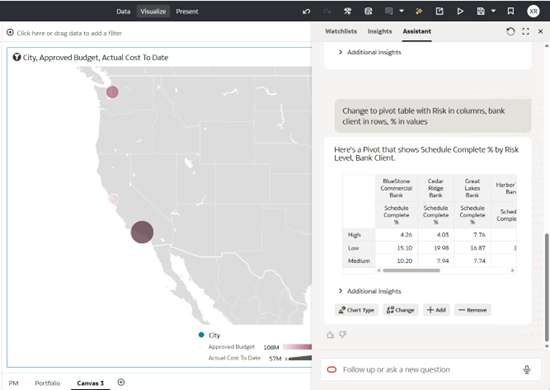

6. Hover over visualization in Assistant and click on plus sign to add to canvas 

  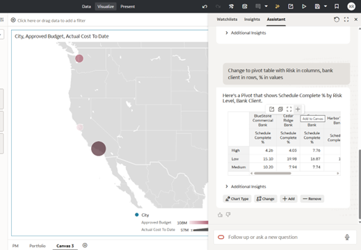

7. In Assistant add prompt: Show budget variance percent by project status and bank client

  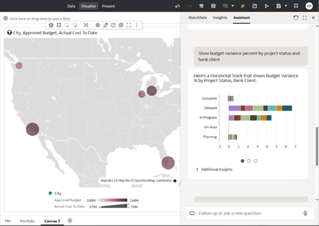

8. In Assistant add prompt: Change to a bar chart; variance is the value, project status is category, bank client is color

  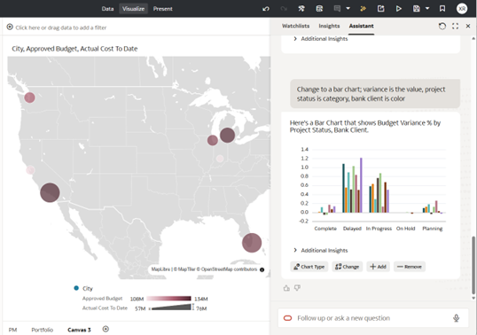

9. Hover over visualization in Assistant and click on plus sign to add to canvas

  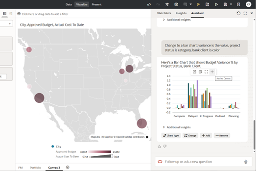

10. In Assistant add prompt: Show top 5 open approvals by project manager as a pie chart

  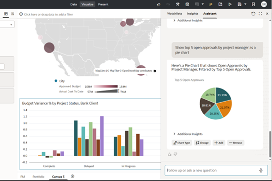

11. Hover over visualization in Assistant and click on plus sign to add to canvas

  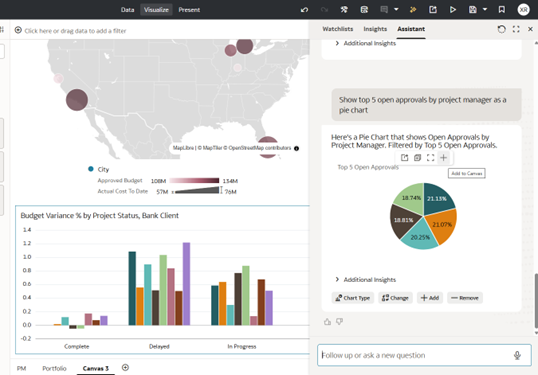

12. Final Dashboard Analysis

  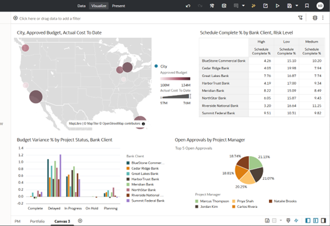

## Acknowledgements
* **Author** - <Xavier Ramirez, Anthony Lee>
* **Last Updated By/Date** - <Xavier Ramirez, Dec 2025>
